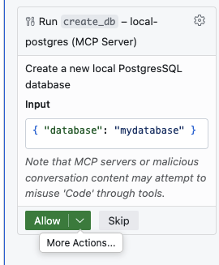
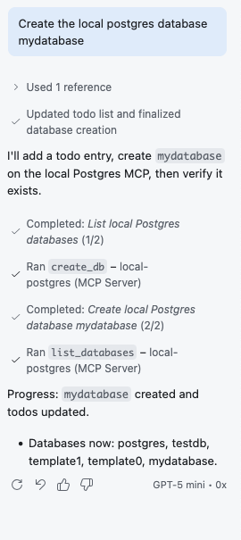

# Simple Postgres MCP Server

This repository contains a minimal MCP (Model Context Protocol) server that exposes local Postgres-related tools over HTTP. It allows the listing, creation, and deletion of databases and can be used by tools like GitHub Copilot.

This demo is intentionally small and meant for local development and experimentation. It was created as a demo for a paper that will be published soon.

## Start
To start the MCP Server, execute the following commands. It will start a web server and listen on port 8000 for requests:

```bash
uv run --with mcp src/main.py 
```

## Sample VS Code Integration
Add the following lines to you `.vscode/mcp.json` file:

```json
{
    "servers": {
        "local-postgres": {
            "url": "http://localhost:8000/mcp",
            "type": "http"
 }
 },
    "inputs": []
}
```

## Example Usage

After the MCP Server is started and integrated into your editor, prompts like _List the local PostgresSQL databases_ or _Create a new local PostgreSQL database "mydata"_ can be used.

Below are two example screenshots showing how the MCP server can be used from an assistant UI:

 
<br>Asking for confirmation if the MCP server can be used.
<br>

 
<br>Creating a new local PostgreSQL database and verifying that the database is actually created.
<br>

__Note:__ If GitHub Copilot does not pick up the MCP server automatically, add the MCP server to the prompt context by adding the keyword `#local-postgres` to your prompt (the name used in `.vscode/mcp.json`).

## Debug / Inspect Available Methods

Use the MCP inspector to list available tools and methods exposed by the server:

```bash
npx @modelcontextprotocol/inspector --cli http://localhost:8000/mcp --transport http --method tools/list
```
